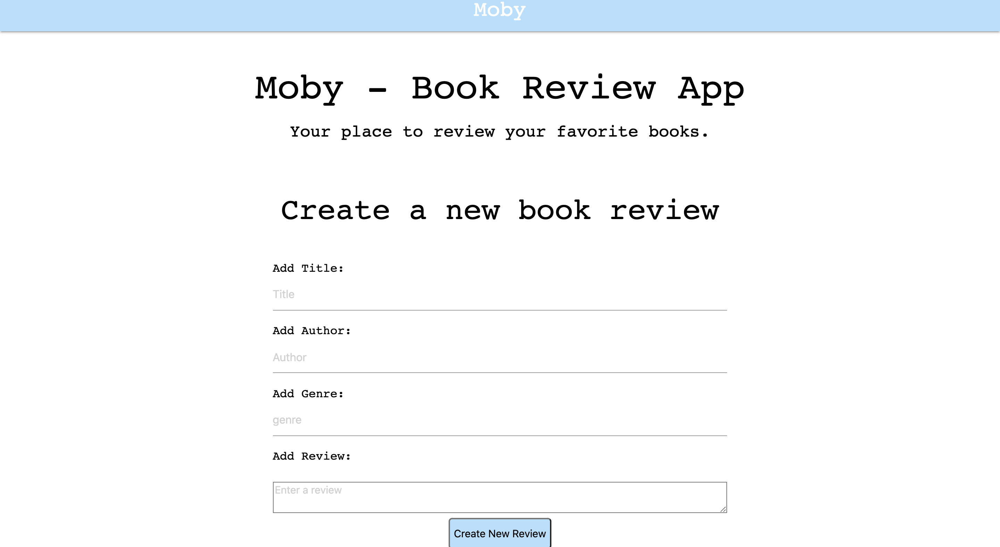

# Moby
[Live App](https://jovial-wozniak-cc011e.netlify.app/)

Moby is a book review app that allows you to add new books and review each book. This project was setup by created a new Rails API on the backend and serving data up to a Vanilla Javascript frontend.




### Getting Started

Here is a step-by-step guide to get the project started.

clone the project:
```
$ git clone 'git@github.com:TerryThreatt/moby.git'
```

get started with the frontend:

```
$ open index.html
```


## Built With

* [Rails](https://rubyonrails.org/) - The web framework used
* [PostgreSQL](https://www.postgresql.org/) - Database management system with ActiveRecord
* [Active Record Serializers](https://github.com/rails-api/active_model_serializers) - Data serializer with ActiveRecord
* [Materialize CSS](https://materializecss.com/) - Frontend CSS framework

## Versioning

This is V1 for the book review Rails API.


## License

This project is licensed under the MIT License - see the [LICENSE](LICENSE) file for details
